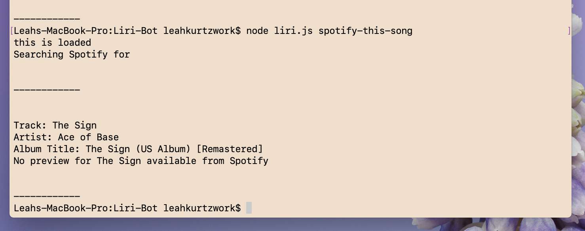
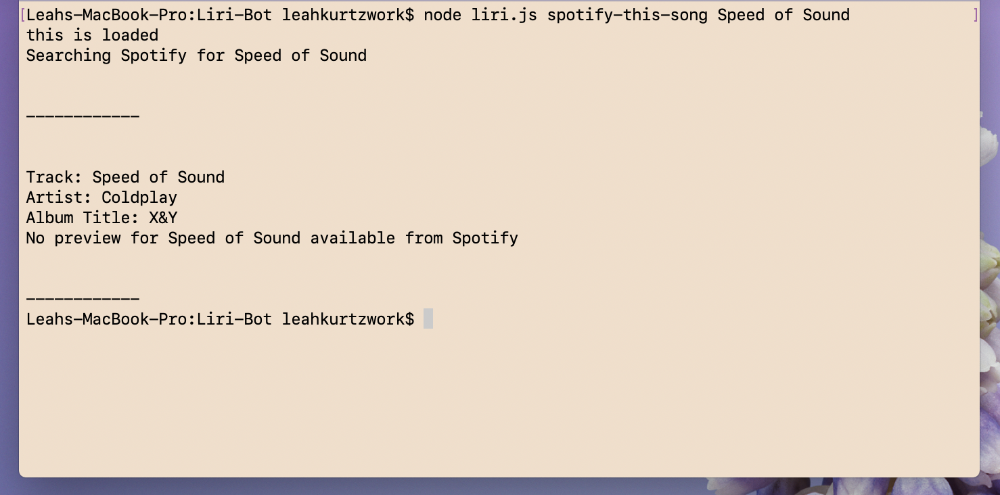
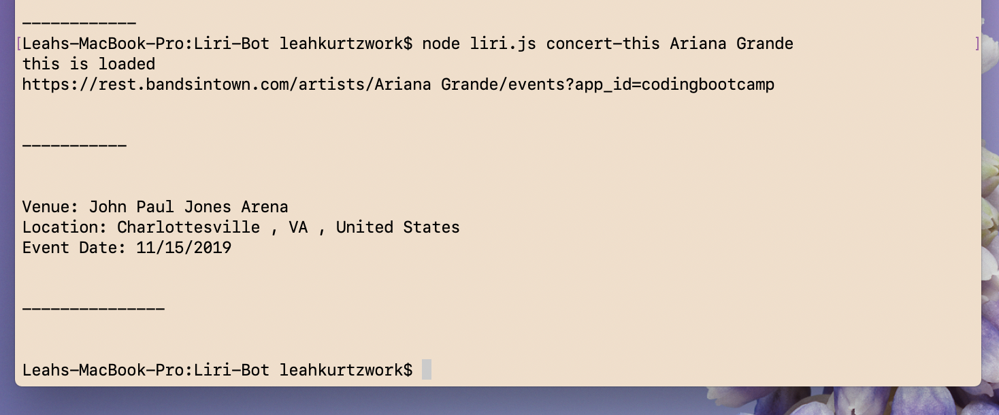
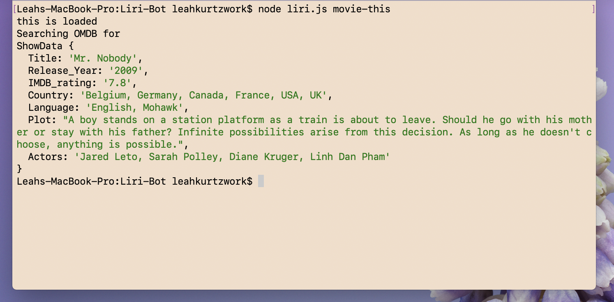
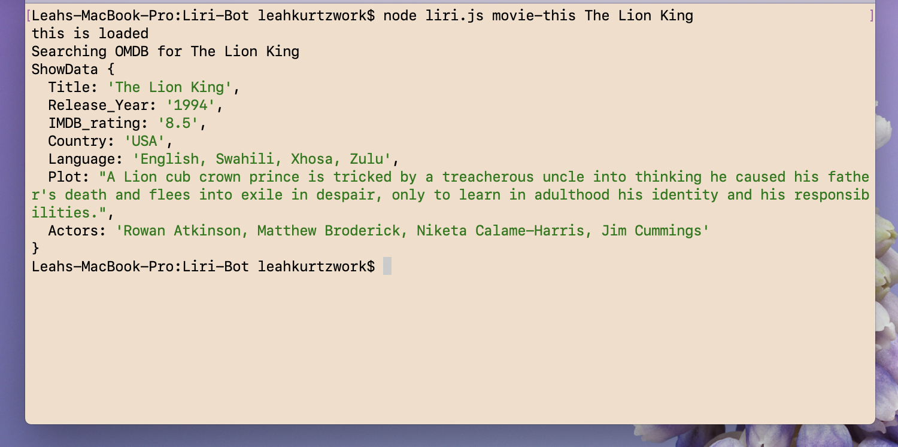
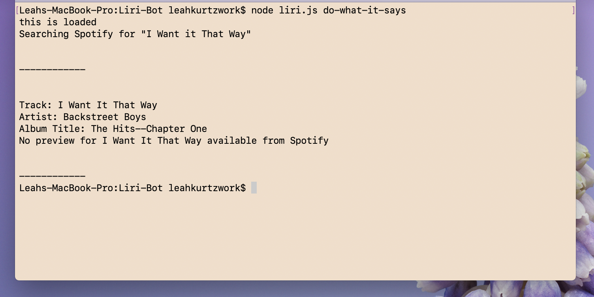

# Liri-Bot
----
## Overview

 Liri Bot is like iPhone's SIRI. However, while SIRI is a Speech Interpretation and Recognition Interface, LIRI is a _Language_ Interpretation and Recognition Interface. LIRI is a command line node app that takes in parameters and gives you back data.
This app was built using javascript alongside moment.js, Spotify API, Bands in Town API, OMDB API, axios, and DotEnv.

----
## Commands and Outcomes

node liri.js spotify-this-song 
> This command will render a song title, artist, album name. It will also return a link to the song's Spotify preview if a preview if a preview for that song is available. If a song is not entered following the command, Liri will return *The Sign* by Ace of Base.

node liri.js concert-this
> If an artist or band entered has upcoming shows, this command will render event venue, venue address, and date in MM/DD/YYY format. If not, Liri will tell the user there is no upcoming shows for the artist entered. 

node liri.js movie-this
> This command will render a movie title, release year, IMDB rating, country, language, plot, and actors. If no movie is entered following the command, Liri will return information for the 2009 film *Mr. Nobody*. 

node liri.js do-what-it-says
> This command will read the random.txt file and return I Want it That Way by the Backstreet Boys.

----
## How to Use
In order to run this app, a Spotify Client ID and Client Secret must be obtained from [Spotify For Developers](https://developer.spotify.com/dashboard/login). Once an account is made, plug in the Client ID and Client Secret in the keys.js file. To render Spotify's data, install the node package by entering the following command into terminal:

    npm install --save node-spotify-api
